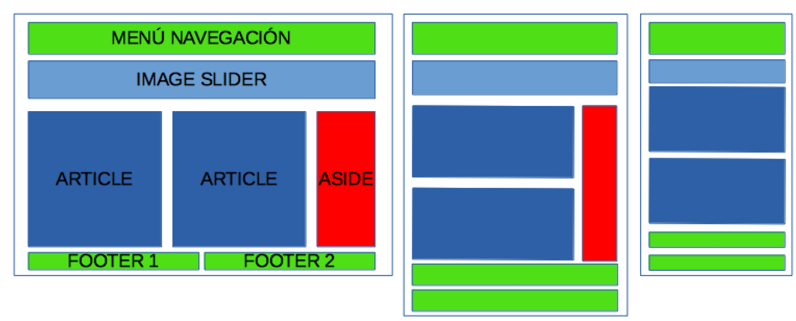
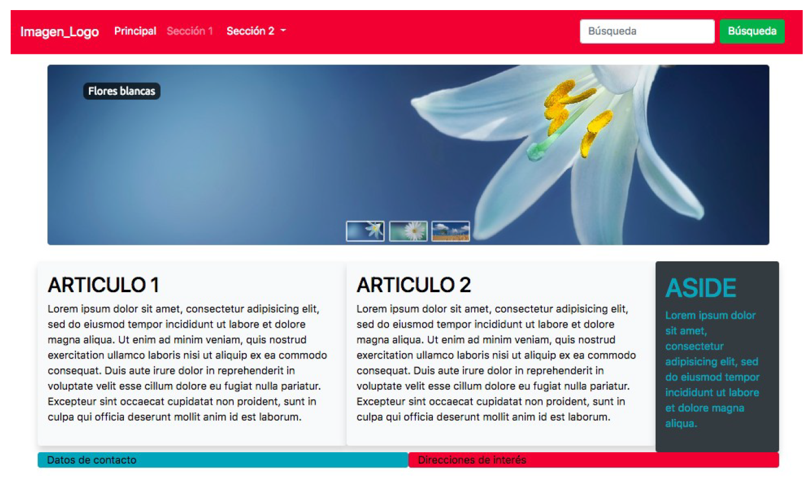
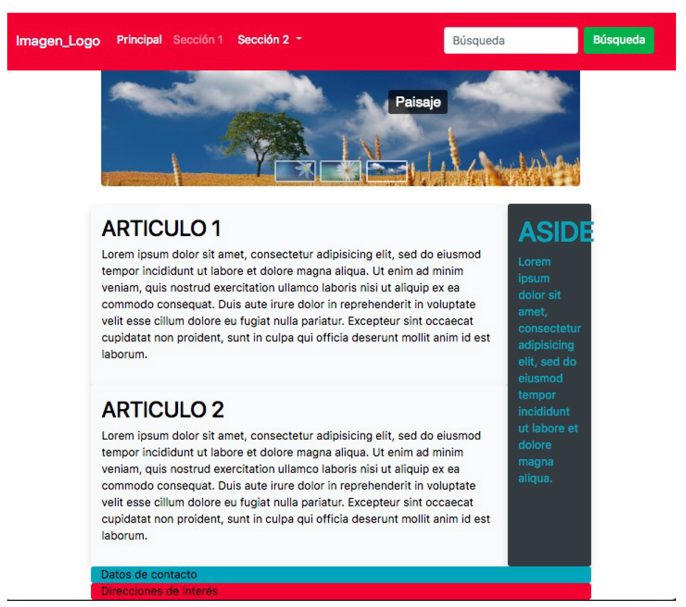
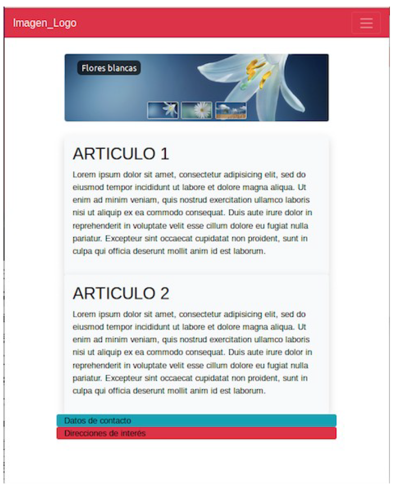

# Examen BootStrap

Construye un pequeño sitio Web estático que use los estilos y componentes de Bootstrap.

La temática, contenidos y estilos del sitio son libres, pero deberá tener al menos las siguientes características:

- El sitio estará formado por, al menos, 3 páginas enlazadas entre sí, una con contenidos estáticos y otra una página de Login no funcional. El login también debe ser responsive.
- Debe ser completamente responsive, de forma que se adapte tanto a pantallas extrapequeñas de smartphone como a tablets y pantallas más grandes de portátiles y de escritorio.
- Debe tener una barra de navegación principal fija en la parte superior, que se contraiga cuando la
pantalla sea pequeña. Esta barra tendrá al menos:
  - Dos enlaces, el segundo debe ser desplegable con dos opciones.
  - Una imagen como logotipo.
  - Un buscador (aunque no sea funcional).
  - Debe aparecer en todas las páginas del sitio.
- El estilo base a utilizar será el que define Bootstrap. Si se definen estilos CSS personalizados tendrán
que estar en un fichero separado, llamado "custom.css", y que será común para todas las páginas del sitio.
- En el esquema de la figura se pueden ver tres disposiciones de la misma web correspondiente a la página principal, la de la izquierda se refiere a los tamaños grandes (xl y lg) y medianos (md), la disposición central al tamaño pequeño o de tablets(sm) y la de la derecha la correspondiente a móviles (xs).
- Tenéis que aplicar las clases de Bootstrap necesarias para que al cambiar el tamaño de la pantalla se cambie la disposición de los bloques como se muestra en el esquema. Tened en cuenta que la columna roja tendrá que desaparecer cuando el tamaño sea extra pequeño (xs).
- Se accederá a las otras dos páginas desde los enlaces de la barra de navegación. En ellas, sólo es necesario que aparezca el menú de navegación con los enlaces a las otras dos páginas, sin más contenido si no quieres.

Al ser una web estática, tendréis que repetir partes del código en todas las páginas, por ejemplo la barra de menú principal tendrá que ser igual en todas las páginas. Por este motivo, se recomienda realizar primero estas partes, y una vez probadas, copiar y pegar el código en el resto de páginas. 

Sólo se diseñará la página principal. Las otra página, debe tener solamente el menú de navegación con la
posibilidad de acceder a las otras páginas desde él, y la página de Login.

Las imágenes siguientes muestran cómo debe quedar la página principal en los distintos formatos:

